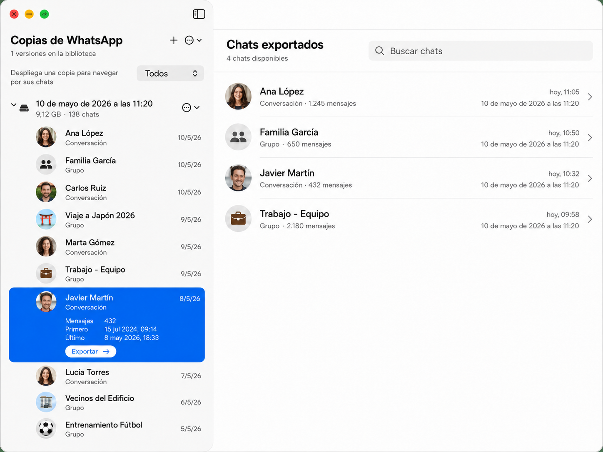

# Free My Chats

**Free My Chats** es una aplicación nativa para macOS que extrae tu WhatsApp de tu copia de seguridad de iPhone y la convierte en una biblioteca local persistente en tu disco duro.

¿Tienes chats de WhatsApp que ocupan varios gigas y que no vas a volver a consultar, pero que no quieres eliminar por el miedo a necesitarlos en el futuro? Ahora con **Free My Chats** puedes guardarlos en el disco duro de tu Mac, con todas sus imágenes y audios, listos para ser explorados y consultados en cualquier momento (y ser guardados para siempre en la copia de seguridad de Time Machine o en tu iCloud). Y puedes borrarlos por fin de tu móvil y recuperar esos gigas preciosos que necesitas urgentemente.



La biblioteca mantiene dos niveles deliberadamente distintos:

- La columna izquierda organiza las distintas copias locales de WhatsApp y muestra claramente el espacio ocupado por cada una.
- Al seleccionar un chat se despliega su información; la exportación física y autocontenida solo se crea al pulsar `Exportar`.
- La columna derecha mantiene un listado independiente de chats exportados. Al pulsar uno abre su `chat.json` y los archivos de `Media`; una flecha permite volver al listado.
- La selección y navegación del panel derecho no cambian al explorar chats o copias en el panel izquierdo.
- Una copia fuente se puede eliminar para liberar espacio sin perder los chats que ya estuvieran exportados.

## Funciones del MVP

- Descubrimiento e inspección de copias de iPhone en MobileSync o en otra carpeta.
- Creación y reapertura de bibliotecas locales con múltiples versiones de una copia.
- Incorporación y eliminación de copias desde el navegador lateral.
- Catálogo de chats con tamaño multimedia en GB, filtros por grupo, persona o archivado,
  y orden por fecha o por tamaño de mayor a menor.
- Vista previa de número de mensajes y fechas antes de exportar.
- Exportación explícita desde la fila desplegada del chat.
- Indicador de actividad mientras se exporta un chat.
- Detección de exportaciones vigentes, desactualizadas o inválidas.
- Visor de mensajes, autores, respuestas con vista previa, reacciones, ubicaciones
  y adjuntos, con reproductor integrado para los audios.
- Navegación entre los mensajes de respuesta y sus originales, con resaltado
  temporal y retorno al punto de partida.
- Búsqueda de texto dentro del chat exportado.
- Acciones para abrir la biblioteca, la carpeta del chat y sus archivos en Finder, o borrar una exportación.
- Limpieza automática de una copia sin fuente cuando se borra su último chat exportado.
- Guía para conceder acceso total al disco y reanudar la inspección tras reiniciar la app.
- Opción de mover a la Papelera la copia original del iPhone después de extraer WhatsApp.

## Estructura de una biblioteca

```text
Mi biblioteca Free My Chats/
├── library.json
├── Sources/
│   └── <sourceId>/
│       ├── Backup/
│       │   ├── ChatStorage.sqlite
│       │   ├── .wa-backup/
│       │   └── …
│       └── Catalog/
│           └── ChatProfilePhotos/
└── Exports/
    └── Copia 2026-04-03 21.26/
        └── Chats/
            └── <chatId>/
                ├── chat.json
                └── Media/
```

`Exports` permanece vacío hasta que el usuario exporta un chat. Los recursos
auxiliares del navegador, como las fotos de perfil, se guardan junto a su copia
fuente. Las bibliotecas anteriores se reorganizan automáticamente al abrirse:
se conservan sus exportaciones y los UUID visibles se sustituyen por nombres de
carpeta basados en la fecha de la copia.

## Descargar el código fuente

La versión estable más reciente está disponible en [GitHub Releases](https://github.com/domingogallardo/FreeMyChats/releases/latest). La publicación incluye únicamente el código fuente: cada persona compila la aplicación en su propio Mac siguiendo la guía inferior.

## Relación con SwiftWABackupAPI

Este proyecto utiliza [SwiftWABackupAPI 4.5.0](https://github.com/domingogallardo/SwiftWABackupAPI/releases/tag/4.5.0), el paquete Swift que implementa el acceso a las copias de iPhone, la extracción de WhatsApp y las exportaciones persistentes de chats.

## Requisitos

- macOS Ventura 13 o posterior.
- Swift 5.9 o posterior.
- Acceso a una carpeta de copias de seguridad de iPhone.
- Permiso de acceso total al disco para la aplicación o Terminal cuando macOS lo requiera.

La ubicación predeterminada de las copias es:

```text
~/Library/Application Support/MobileSync/Backup/
```

## Guía para descargar, compilar y ejecutar

No hace falta saber programar, pero sí utilizar brevemente la aplicación Terminal. El proceso no modifica el sistema y se puede repetir cuando se publique una versión nueva.

### 1. Instalar las herramientas de Apple

Abre **Terminal** desde `Aplicaciones > Utilidades > Terminal`, copia este comando, pégalo y pulsa Intro:

```bash
xcode-select --install
```

macOS mostrará una ventana para instalar las herramientas de desarrollo. Si indica que ya están instaladas, continúa con el siguiente paso.

### 2. Descargar Free My Chats

En la página de la [versión más reciente](https://github.com/domingogallardo/FreeMyChats/releases/latest), abre el apartado **Assets** y descarga **Source code (zip)**. Descomprime el ZIP con doble clic y mueve la carpeta resultante a un lugar que recuerdes, por ejemplo `Documentos`.

### 3. Abrir la carpeta desde Terminal

Escribe `cd` seguido de un espacio en Terminal. Arrastra la carpeta descomprimida desde Finder hasta la ventana de Terminal y pulsa Intro. El comando tendrá un aspecto parecido a este:

```bash
cd ~/Documents/FreeMyChats-1.3.1
```

### 4. Compilar y abrir la aplicación

Ejecuta:

```bash
./script/build_and_run.sh
```

La primera compilación puede tardar unos minutos porque Swift Package Manager descarga SwiftWABackupAPI y sus dependencias. Al terminar, el script crea `dist/FreeMyChats.app` y abre la aplicación automáticamente.

Las siguientes ejecuciones se pueden hacer con doble clic sobre `FreeMyChats.app`, dentro de la carpeta `dist`, o repitiendo el comando anterior para volver a compilar.

### 5. Conceder acceso a las copias del iPhone

Si macOS impide leer la copia, abre `Ajustes del Sistema > Privacidad y seguridad > Acceso total al disco`, activa el permiso para **Free My Chats** y reinicia la aplicación. La app volverá a comprobar el acceso al arrancar.

### Alternativa para personas familiarizadas con Git

```bash
git clone https://github.com/domingogallardo/FreeMyChats.git
cd FreeMyChats
./script/build_and_run.sh
```

## Privacidad

FreeMyChats está pensado para tareas legítimas de copia, recuperación y análisis personal. Utiliza únicamente copias sobre las que tengas derecho de acceso y respeta la privacidad de las personas participantes en las conversaciones.

## Licencia

Free My Chats se distribuye bajo la [PolyForm Noncommercial License 1.0.0](LICENSE.md). Puedes descargar, estudiar, modificar y redistribuir el código con fines no comerciales. No puedes vender la aplicación ni utilizar el código o sus modificaciones para crear un producto o servicio comercial.

Esta es una licencia de código fuente disponible, no una licencia _open source_ aprobada por la OSI, porque restringe expresamente el uso comercial.
